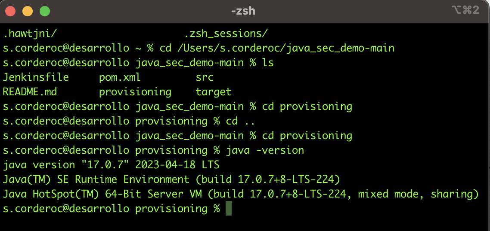
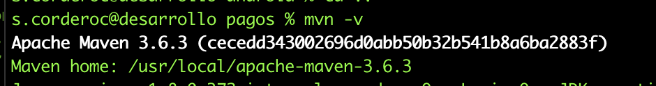
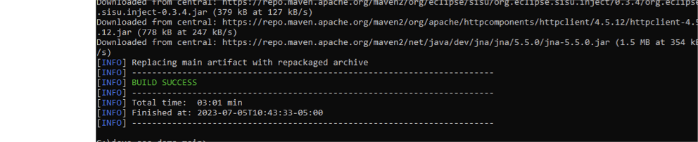
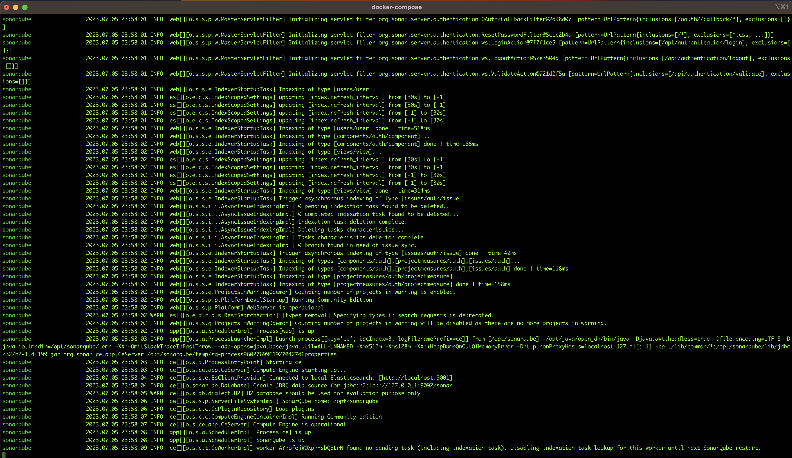
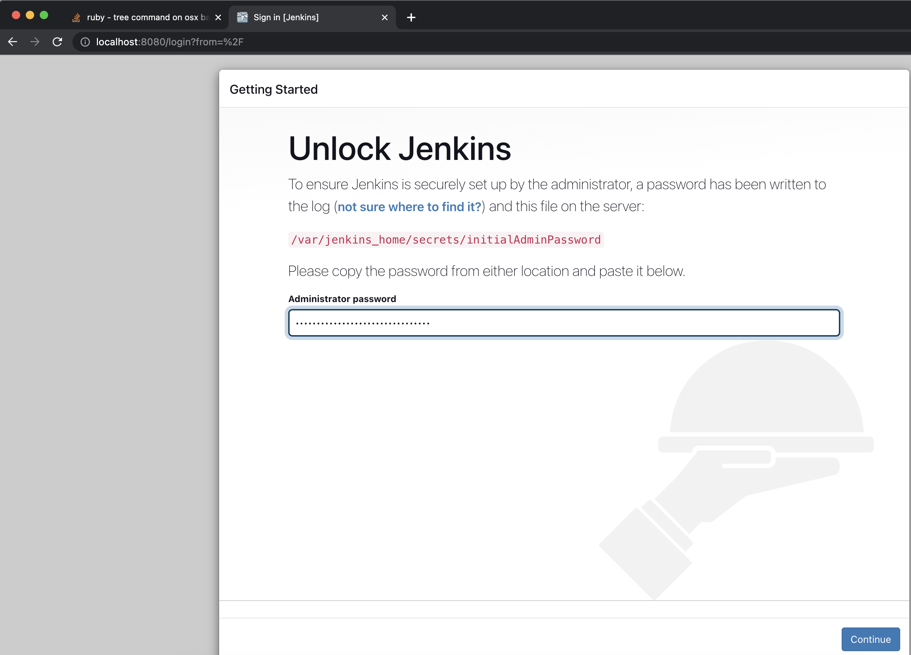
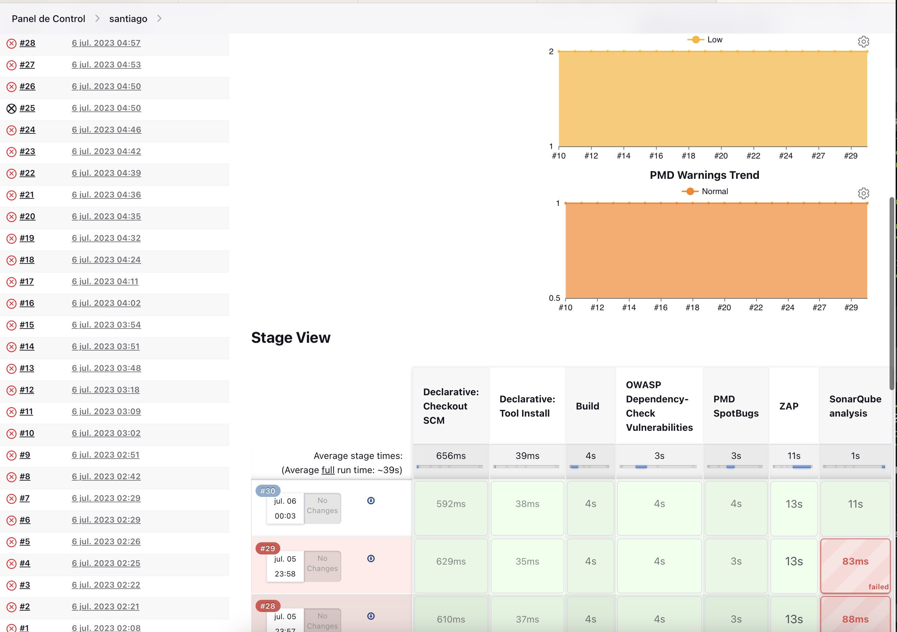

# EJECUCION
verificamos la versión de java 17
```
java -version
```



Verificamos la version de maven 3.6.3
```
mvn -version
```


Una vez verificada la versión de java y maven procedemos a realizar la instalación

## Ejecución
Nos ubicamos en el directorio donde se encuentra el archivo java_sec_demo-main

```cd ~/java_sec_demo-main ```

Ejecutamos el comando de compilación
```
mvn clean package
```
Luego constribimos el contenedor de la aplicación y ejecutamos el comando de levantamiento
```
mvn clean package jib:dockerBuild
```

## Docker   
Levantamos el docker dentro del provisioning
```
docker-compose up
```


### Iniciamos y confifuramos Jenkins
```
https://localhost:8080/jenkins
```
84a581bee2c547d6bff0327e482515f6



Dentro del directorio /provisioning
```
docker ps
```
```bash
docker exec -it 4a8b19d6829 /bin/bash
```
```yaml
cat /var/jenkins_home/secrets/initialAdminPassword
```

##  Resultado del comando

# Log
```bash
Started by user Santiago Cordero
Obtained Jenkinsfile from git https://github.com/scordero1234/java_sec_demo-main.git
[Pipeline] Start of Pipeline
[Pipeline] node
Running on Jenkins in /var/jenkins_home/workspace/santiago
[Pipeline] {
[Pipeline] stage
[Pipeline] { (Declarative: Checkout SCM)
[Pipeline] checkout
The recommended git tool is: git
No credentials specified
 > git rev-parse --resolve-git-dir /var/jenkins_home/workspace/santiago/.git # timeout=10
Fetching changes from the remote Git repository
 > git config remote.origin.url https://github.com/scordero1234/java_sec_demo-main.git # timeout=10
Fetching upstream changes from https://github.com/scordero1234/java_sec_demo-main.git
 > git --version # timeout=10
 > git --version # 'git version 2.30.2'
 > git fetch --tags --force --progress -- https://github.com/scordero1234/java_sec_demo-main.git +refs/heads/*:refs/remotes/origin/* # timeout=10
 > git rev-parse refs/remotes/origin/desarrollo^{commit} # timeout=10
Checking out Revision d3e36f3c2a7515bb0b2ae6495d053d526cf97918 (refs/remotes/origin/desarrollo)
 > git config core.sparsecheckout # timeout=10
 > git checkout -f d3e36f3c2a7515bb0b2ae6495d053d526cf97918 # timeout=10
Commit message: "prueba4"
 > git rev-list --no-walk d3e36f3c2a7515bb0b2ae6495d053d526cf97918 # timeout=10
[Pipeline] }
[Pipeline] // stage
[Pipeline] withEnv
[Pipeline] {
[Pipeline] stage
[Pipeline] { (Declarative: Tool Install)
[Pipeline] tool
[Pipeline] envVarsForTool
[Pipeline] tool
[Pipeline] envVarsForTool
[Pipeline] }
[Pipeline] // stage
[Pipeline] withEnv
[Pipeline] {
[Pipeline] stage
[Pipeline] { (Build)
[Pipeline] tool
[Pipeline] envVarsForTool
[Pipeline] tool
[Pipeline] envVarsForTool
[Pipeline] withEnv
[Pipeline] {
[Pipeline] withMaven
[Pipeline] {
[Pipeline] sh
+ mvn package
Picked up JAVA_TOOL_OPTIONS: -Dmaven.ext.class.path="/var/jenkins_home/workspace/santiago@tmp/withMavenf9a8ce6c/pipeline-maven-spy.jar" -Dorg.jenkinsci.plugins.pipeline.maven.reportsFolder="/var/jenkins_home/workspace/santiago@tmp/withMavenf9a8ce6c" 
[INFO] [jenkins-event-spy] Generate /var/jenkins_home/workspace/santiago@tmp/withMavenf9a8ce6c/maven-spy-20230706-050304-3595169959247317192511.log.tmp ...
[INFO] Scanning for projects...
[INFO] 
[INFO] ------------------< nl.amis.smeetsm:spring-boot-demo >------------------
[INFO] Building spring-boot-demo 0.0.1-SNAPSHOT
[INFO] --------------------------------[ jar ]---------------------------------
[INFO] 
[INFO] --- jacoco-maven-plugin:0.8.6:prepare-agent (default) @ spring-boot-demo ---
[INFO] argLine set to -javaagent:/var/jenkins_home/.m2/repository/org/jacoco/org.jacoco.agent/0.8.6/org.jacoco.agent-0.8.6-runtime.jar=destfile=/var/jenkins_home/workspace/santiago/target/jacoco.exec
[INFO] 
[INFO] --- maven-resources-plugin:3.1.0:resources (default-resources) @ spring-boot-demo ---
[INFO] Using 'UTF-8' encoding to copy filtered resources.
[INFO] Copying 1 resource
[INFO] Copying 3 resources
[INFO] 
[INFO] --- maven-compiler-plugin:3.8.1:compile (default-compile) @ spring-boot-demo ---
[INFO] Changes detected - recompiling the module!
[INFO] Compiling 4 source files to /var/jenkins_home/workspace/santiago/target/classes
[INFO] 
[INFO] --- maven-resources-plugin:3.1.0:testResources (default-testResources) @ spring-boot-demo ---
[INFO] Using 'UTF-8' encoding to copy filtered resources.
[INFO] skip non existing resourceDirectory /var/jenkins_home/workspace/santiago/src/test/resources
[INFO] 
[INFO] --- maven-compiler-plugin:3.8.1:testCompile (default-testCompile) @ spring-boot-demo ---
[INFO] Changes detected - recompiling the module!
[INFO] Compiling 2 source files to /var/jenkins_home/workspace/santiago/target/test-classes
[INFO] 
[INFO] --- maven-surefire-plugin:2.22.2:test (default-test) @ spring-boot-demo ---
[INFO] 
[INFO] -------------------------------------------------------
[INFO]  T E S T S
[INFO] -------------------------------------------------------
[INFO] Running nl.amis.smeetsm.demoservice.DemoserviceApplicationTests
05:03:05.806 [main] DEBUG org.springframework.test.context.BootstrapUtils - Instantiating CacheAwareContextLoaderDelegate from class [org.springframework.test.context.cache.DefaultCacheAwareContextLoaderDelegate]
05:03:05.815 [main] DEBUG org.springframework.test.context.BootstrapUtils - Instantiating BootstrapContext using constructor [public org.springframework.test.context.support.DefaultBootstrapContext(java.lang.Class,org.springframework.test.context.CacheAwareContextLoaderDelegate)]
05:03:05.838 [main] DEBUG org.springframework.test.context.BootstrapUtils - Instantiating TestContextBootstrapper for test class [nl.amis.smeetsm.demoservice.DemoserviceApplicationTests] from class [org.springframework.boot.test.context.SpringBootTestContextBootstrapper]
05:03:05.847 [main] INFO org.springframework.boot.test.context.SpringBootTestContextBootstrapper - Neither @ContextConfiguration nor @ContextHierarchy found for test class [nl.amis.smeetsm.demoservice.DemoserviceApplicationTests], using SpringBootContextLoader
05:03:05.850 [main] DEBUG org.springframework.test.context.support.AbstractContextLoader - Did not detect default resource location for test class [nl.amis.smeetsm.demoservice.DemoserviceApplicationTests]: class path resource [nl/amis/smeetsm/demoservice/DemoserviceApplicationTests-context.xml] does not exist
05:03:05.851 [main] DEBUG org.springframework.test.context.support.AbstractContextLoader - Did not detect default resource location for test class [nl.amis.smeetsm.demoservice.DemoserviceApplicationTests]: class path resource [nl/amis/smeetsm/demoservice/DemoserviceApplicationTestsContext.groovy] does not exist
05:03:05.851 [main] INFO org.springframework.test.context.support.AbstractContextLoader - Could not detect default resource locations for test class [nl.amis.smeetsm.demoservice.DemoserviceApplicationTests]: no resource found for suffixes {-context.xml, Context.groovy}.
05:03:05.851 [main] INFO org.springframework.test.context.support.AnnotationConfigContextLoaderUtils - Could not detect default configuration classes for test class [nl.amis.smeetsm.demoservice.DemoserviceApplicationTests]: DemoserviceApplicationTests does not declare any static, non-private, non-final, nested classes annotated with @Configuration.
05:03:05.873 [main] DEBUG org.springframework.test.context.support.ActiveProfilesUtils - Could not find an 'annotation declaring class' for annotation type [org.springframework.test.context.ActiveProfiles] and class [nl.amis.smeetsm.demoservice.DemoserviceApplicationTests]
05:03:05.907 [main] DEBUG org.springframework.context.annotation.ClassPathScanningCandidateComponentProvider - Identified candidate component class: file [/var/jenkins_home/workspace/santiago/target/classes/nl/amis/smeetsm/demoservice/DemoserviceApplication.class]
05:03:05.907 [main] INFO org.springframework.boot.test.context.SpringBootTestContextBootstrapper - Found @SpringBootConfiguration nl.amis.smeetsm.demoservice.DemoserviceApplication for test class nl.amis.smeetsm.demoservice.DemoserviceApplicationTests
05:03:05.961 [main] DEBUG org.springframework.boot.test.context.SpringBootTestContextBootstrapper - @TestExecutionListeners is not present for class [nl.amis.smeetsm.demoservice.DemoserviceApplicationTests]: using defaults.
05:03:05.961 [main] INFO org.springframework.boot.test.context.SpringBootTestContextBootstrapper - Loaded default TestExecutionListener class names from location [META-INF/spring.factories]: [org.springframework.boot.test.mock.mockito.MockitoTestExecutionListener, org.springframework.boot.test.mock.mockito.ResetMocksTestExecutionListener, org.springframework.boot.test.autoconfigure.restdocs.RestDocsTestExecutionListener, org.springframework.boot.test.autoconfigure.web.client.MockRestServiceServerResetTestExecutionListener, org.springframework.boot.test.autoconfigure.web.servlet.MockMvcPrintOnlyOnFailureTestExecutionListener, org.springframework.boot.test.autoconfigure.web.servlet.WebDriverTestExecutionListener, org.springframework.boot.test.autoconfigure.webservices.client.MockWebServiceServerTestExecutionListener, org.springframework.test.context.web.ServletTestExecutionListener, org.springframework.test.context.support.DirtiesContextBeforeModesTestExecutionListener, org.springframework.test.context.support.DependencyInjectionTestExecutionListener, org.springframework.test.context.support.DirtiesContextTestExecutionListener, org.springframework.test.context.transaction.TransactionalTestExecutionListener, org.springframework.test.context.jdbc.SqlScriptsTestExecutionListener, org.springframework.test.context.event.EventPublishingTestExecutionListener]
05:03:05.977 [main] DEBUG org.springframework.boot.test.context.SpringBootTestContextBootstrapper - Skipping candidate TestExecutionListener [org.springframework.test.context.transaction.TransactionalTestExecutionListener] due to a missing dependency. Specify custom listener classes or make the default listener classes and their required dependencies available. Offending class: [org/springframework/transaction/interceptor/TransactionAttributeSource]
05:03:05.979 [main] DEBUG org.springframework.boot.test.context.SpringBootTestContextBootstrapper - Skipping candidate TestExecutionListener [org.springframework.test.context.jdbc.SqlScriptsTestExecutionListener] due to a missing dependency. Specify custom listener classes or make the default listener classes and their required dependencies available. Offending class: [org/springframework/transaction/interceptor/TransactionAttribute]
05:03:05.980 [main] INFO org.springframework.boot.test.context.SpringBootTestContextBootstrapper - Using TestExecutionListeners: [org.springframework.test.context.web.ServletTestExecutionListener@1d2c253, org.springframework.test.context.support.DirtiesContextBeforeModesTestExecutionListener@15a484a9, org.springframework.boot.test.mock.mockito.MockitoTestExecutionListener@b56c222, org.springframework.boot.test.autoconfigure.SpringBootDependencyInjectionTestExecutionListener@5a2035e1, org.springframework.test.context.support.DirtiesContextTestExecutionListener@4df7b4ac, org.springframework.test.context.event.EventPublishingTestExecutionListener@7c47e077, org.springframework.boot.test.mock.mockito.ResetMocksTestExecutionListener@41bd6a0f, org.springframework.boot.test.autoconfigure.restdocs.RestDocsTestExecutionListener@1ae9d0e4, org.springframework.boot.test.autoconfigure.web.client.MockRestServiceServerResetTestExecutionListener@6acb45c1, org.springframework.boot.test.autoconfigure.web.servlet.MockMvcPrintOnlyOnFailureTestExecutionListener@294c44b7, org.springframework.boot.test.autoconfigure.web.servlet.WebDriverTestExecutionListener@30bbe83, org.springframework.boot.test.autoconfigure.webservices.client.MockWebServiceServerTestExecutionListener@57b130f6]
05:03:05.981 [main] DEBUG org.springframework.test.context.support.AbstractDirtiesContextTestExecutionListener - Before test class: context [DefaultTestContext@45b8bbbf testClass = DemoserviceApplicationTests, testInstance = [null], testMethod = [null], testException = [null], mergedContextConfiguration = [WebMergedContextConfiguration@1df06ecd testClass = DemoserviceApplicationTests, locations = '{}', classes = '{class nl.amis.smeetsm.demoservice.DemoserviceApplication}', contextInitializerClasses = '[]', activeProfiles = '{}', propertySourceLocations = '{}', propertySourceProperties = '{org.springframework.boot.test.context.SpringBootTestContextBootstrapper=true}', contextCustomizers = set[org.springframework.boot.test.context.filter.ExcludeFilterContextCustomizer@43ecfeb5, org.springframework.boot.test.json.DuplicateJsonObjectContextCustomizerFactory$DuplicateJsonObjectContextCustomizer@68ddd415, org.springframework.boot.test.mock.mockito.MockitoContextCustomizer@0, org.springframework.boot.test.web.client.TestRestTemplateContextCustomizer@e29f4f6, org.springframework.boot.test.autoconfigure.properties.PropertyMappingContextCustomizer@0, org.springframework.boot.test.autoconfigure.web.servlet.WebDriverContextCustomizerFactory$Customizer@b791a81, org.springframework.boot.test.context.SpringBootTestArgs@1], resourceBasePath = 'src/main/webapp', contextLoader = 'org.springframework.boot.test.context.SpringBootContextLoader', parent = [null]], attributes = map['org.springframework.test.context.web.ServletTestExecutionListener.activateListener' -> true]], class annotated with @DirtiesContext [false] with mode [null].
05:03:05.996 [main] DEBUG org.springframework.test.context.support.TestPropertySourceUtils - Adding inlined properties to environment: {spring.jmx.enabled=false, org.springframework.boot.test.context.SpringBootTestContextBootstrapper=true}

  .   ____          _            __ _ _
 /\\ / ___'_ __ _ _(_)_ __  __ _ \ \ \ \
( ( )\___ | '_ | '_| | '_ \/ _` | \ \ \ \
 \\/  ___)| |_)| | | | | || (_| |  ) ) ) )
  '  |____| .__|_| |_|_| |_\__, | / / / /
 =========|_|==============|___/=/_/_/_/
 :: Spring Boot ::        (v2.3.4.RELEASE)

2023-07-06 05:03:06.124  INFO 9158 --- [           main] n.a.s.d.DemoserviceApplicationTests      : Starting DemoserviceApplicationTests on 4a8b19d68529 with PID 9158 (started by jenkins in /var/jenkins_home/workspace/santiago)
2023-07-06 05:03:06.124  INFO 9158 --- [           main] n.a.s.d.DemoserviceApplicationTests      : No active profile set, falling back to default profiles: default
2023-07-06 05:03:06.840  INFO 9158 --- [           main] o.s.s.concurrent.ThreadPoolTaskExecutor  : Initializing ExecutorService 'applicationTaskExecutor'
2023-07-06 05:03:07.048  INFO 9158 --- [           main] o.s.b.a.e.web.EndpointLinksResolver      : Exposing 2 endpoint(s) beneath base path '/actuator'
2023-07-06 05:03:07.068  INFO 9158 --- [           main] n.a.s.d.DemoserviceApplicationTests      : Started DemoserviceApplicationTests in 1.066 seconds (JVM running for 1.703)
[INFO] Tests run: 1, Failures: 0, Errors: 0, Skipped: 0, Time elapsed: 1.485 s - in nl.amis.smeetsm.demoservice.DemoserviceApplicationTests
2023-07-06 05:03:07.255  INFO 9158 --- [extShutdownHook] o.s.s.concurrent.ThreadPoolTaskExecutor  : Shutting down ExecutorService 'applicationTaskExecutor'
[INFO] 
[INFO] Results:
[INFO] 
[INFO] Tests run: 1, Failures: 0, Errors: 0, Skipped: 0
[INFO] 
[INFO] 
[INFO] --- jacoco-maven-plugin:0.8.6:report (report) @ spring-boot-demo ---
[INFO] Loading execution data file /var/jenkins_home/workspace/santiago/target/jacoco.exec
[INFO] Analyzed bundle 'spring-boot-demo' with 2 classes
[INFO] 
[INFO] --- maven-jar-plugin:3.2.0:jar (default-jar) @ spring-boot-demo ---
[INFO] Building jar: /var/jenkins_home/workspace/santiago/target/spring-boot-demo-0.0.1-SNAPSHOT.jar
[INFO] 
[INFO] --- spring-boot-maven-plugin:2.3.4.RELEASE:repackage (repackage) @ spring-boot-demo ---
[INFO] Replacing main artifact with repackaged archive
[INFO] ------------------------------------------------------------------------
[INFO] BUILD SUCCESS
[INFO] ------------------------------------------------------------------------
[INFO] Total time:  3.598 s
[INFO] Finished at: 2023-07-06T05:03:08Z
[INFO] ------------------------------------------------------------------------
[INFO] [jenkins-event-spy] Generated /var/jenkins_home/workspace/santiago@tmp/withMavenf9a8ce6c/maven-spy-20230706-050304-3595169959247317192511.log
[Pipeline] }
[withMaven] artifactsPublisher - Archive artifact pom.xml under nl/amis/smeetsm/spring-boot-demo/0.0.1-SNAPSHOT/spring-boot-demo-0.0.1-SNAPSHOT.pom
[withMaven] artifactsPublisher - Archive artifact target/spring-boot-demo-0.0.1-SNAPSHOT.jar under nl/amis/smeetsm/spring-boot-demo/0.0.1-SNAPSHOT/spring-boot-demo-0.0.1-SNAPSHOT.jar
[withMaven] junitPublisher - Archive test results for Maven artifact nl.amis.smeetsm:spring-boot-demo:jar:0.0.1-SNAPSHOT generated by maven-surefire-plugin:test (default-test): target/surefire-reports/*.xml
[withMaven] junitPublisher - Jenkins JUnit Attachments Plugin not found, can't publish test attachments.
[withMaven] junitPublisher - Jenkins JUnit Flaky Test Handler Plugin not found, can't publish JUnit flaky tests reports.
Recording test results
[Checks API] No suitable checks publisher found.
[withMaven] Jenkins FindBugs Plugin not found, don't display org.codehaus.mojo:findbugs-maven-plugin:findbugs results in pipeline screen.
[withMaven] jgivenPublisher - Jenkins JGiven Plugin not found, do not archive jgiven reports.
[withMaven] Jenkins JaCoCo Plugin not found, don't display org.jacoco:jacoco-maven-plugin:prepare-agent[-integration] results in pipeline screen.
[withMaven] Jenkins Task Scanner Plugin not found, don't display results of source code scanning for 'TODO' and 'FIXME' in pipeline screen.
[withMaven] Publishers: Pipeline Graph Publisher: 1 ms, Generated Artifacts Publisher: 109 ms, Junit Publisher: 3 ms
[Pipeline] // withMaven
[Pipeline] }
[Pipeline] // withEnv
[Pipeline] }
[Pipeline] // stage
[Pipeline] stage
[Pipeline] { (OWASP Dependency-Check Vulnerabilities)
[Pipeline] tool
[Pipeline] envVarsForTool
[Pipeline] tool
[Pipeline] envVarsForTool
[Pipeline] withEnv
[Pipeline] {
[Pipeline] withMaven
[Pipeline] {
[Pipeline] sh
+ mvn dependency-check:check
Picked up JAVA_TOOL_OPTIONS: -Dmaven.ext.class.path="/var/jenkins_home/workspace/santiago@tmp/withMaven8e058b80/pipeline-maven-spy.jar" -Dorg.jenkinsci.plugins.pipeline.maven.reportsFolder="/var/jenkins_home/workspace/santiago@tmp/withMaven8e058b80" 
[INFO] [jenkins-event-spy] Generate /var/jenkins_home/workspace/santiago@tmp/withMaven8e058b80/maven-spy-20230706-050308-82210779987766735749436.log.tmp ...
[INFO] Scanning for projects...
[INFO] 
[INFO] ------------------< nl.amis.smeetsm:spring-boot-demo >------------------
[INFO] Building spring-boot-demo 0.0.1-SNAPSHOT
[INFO] --------------------------------[ jar ]---------------------------------
[INFO] 
[INFO] --- dependency-check-maven:6.1.1:check (default-cli) @ spring-boot-demo ---
[INFO] Checking for updates
[INFO] Skipping NVD check since last check was within 4 hours.
[INFO] Skipping RetireJS update since last update was within 24 hours.
[INFO] Check for updates complete (51 ms)
[INFO] 

Dependency-Check is an open source tool performing a best effort analysis of 3rd party dependencies; false positives and false negatives may exist in the analysis performed by the tool. Use of the tool and the reporting provided constitutes acceptance for use in an AS IS condition, and there are NO warranties, implied or otherwise, with regard to the analysis or its use. Any use of the tool and the reporting provided is at the user’s risk. In no event shall the copyright holder or OWASP be held liable for any damages whatsoever arising out of or in connection with the use of this tool, the analysis performed, or the resulting report.


[INFO] Analysis Started
[INFO] Finished Archive Analyzer (0 seconds)
[INFO] Finished File Name Analyzer (0 seconds)
[INFO] Finished Jar Analyzer (0 seconds)
[INFO] Finished Dependency Merging Analyzer (0 seconds)
[INFO] Finished Version Filter Analyzer (0 seconds)
[INFO] Finished Hint Analyzer (0 seconds)
[INFO] Created CPE Index (0 seconds)
[INFO] Finished CPE Analyzer (0 seconds)
[INFO] Finished False Positive Analyzer (0 seconds)
[INFO] Finished NVD CVE Analyzer (0 seconds)
[INFO] Finished Sonatype OSS Index Analyzer (0 seconds)
[INFO] Finished Vulnerability Suppression Analyzer (0 seconds)
[INFO] Finished Dependency Bundling Analyzer (0 seconds)
[INFO] Analysis Complete (1 seconds)
[INFO] Writing report to: /var/jenkins_home/workspace/santiago/target/dependency-check-report.xml
[INFO] Writing report to: /var/jenkins_home/workspace/santiago/target/dependency-check-report.html
[INFO] Writing report to: /var/jenkins_home/workspace/santiago/target/dependency-check-report.json
[INFO] Writing report to: /var/jenkins_home/workspace/santiago/target/dependency-check-report.csv
[INFO] Writing report to: /var/jenkins_home/workspace/santiago/target/dependency-check-report.sarif
[INFO] Writing report to: /var/jenkins_home/workspace/santiago/target/dependency-check-junit.xml
[WARNING] 

One or more dependencies were identified with known vulnerabilities in spring-boot-demo:

commons-io-2.6.jar (pkg:maven/commons-io/commons-io@2.6) : CVE-2021-29425
gson-2.8.6.jar (pkg:maven/com.google.code.gson/gson@2.8.6) : CVE-2022-25647
jackson-databind-2.11.2.jar (pkg:maven/com.fasterxml.jackson.core/jackson-databind@2.11.2, cpe:2.3:a:fasterxml:jackson-databind:2.11.2:*:*:*:*:*:*:*, cpe:2.3:a:fasterxml:jackson-modules-java8:2.11.2:*:*:*:*:*:*:*) : CVE-2020-36518, CVE-2021-46877, CVE-2022-42003, CVE-2022-42004, CVE-2023-35116
jakarta.el-3.0.3.jar (pkg:maven/org.glassfish/jakarta.el@3.0.3) : CVE-2021-28170
log4j-api-2.13.3.jar (pkg:maven/org.apache.logging.log4j/log4j-api@2.13.3, cpe:2.3:a:apache:log4j:2.13.3:*:*:*:*:*:*:*) : CVE-2021-45046
logback-core-1.2.3.jar (pkg:maven/ch.qos.logback/logback-core@1.2.3, cpe:2.3:a:qos:logback:1.2.3:*:*:*:*:*:*:*) : CVE-2021-42550
snakeyaml-1.26.jar (pkg:maven/org.yaml/snakeyaml@1.26, cpe:2.3:a:snakeyaml_project:snakeyaml:1.26:*:*:*:*:*:*:*, cpe:2.3:a:yaml_project:yaml:1.26:*:*:*:*:*:*:*) : CVE-2022-1471, CVE-2022-25857, CVE-2022-38749, CVE-2022-38750, CVE-2022-38751, CVE-2022-38752, CVE-2022-41854, CVE-2023-2251
spring-beans-5.2.9.RELEASE.jar (pkg:maven/org.springframework/spring-beans@5.2.9.RELEASE, cpe:2.3:a:pivotal_software:spring_framework:5.2.9:release:*:*:*:*:*:*, cpe:2.3:a:springsource:spring_framework:5.2.9:release:*:*:*:*:*:*, cpe:2.3:a:vmware:spring_framework:5.2.9:release:*:*:*:*:*:*) : CVE-2022-22965, CVE-2023-20861, CVE-2023-20863
spring-boot-2.3.4.RELEASE.jar (pkg:maven/org.springframework.boot/spring-boot@2.3.4.RELEASE, cpe:2.3:a:vmware:spring_boot:2.3.4:release:*:*:*:*:*:*, cpe:2.3:a:vmware:spring_framework:2.3.4:release:*:*:*:*:*:*) : CVE-2013-4152, CVE-2013-7315, CVE-2018-11039, CVE-2018-11040, CVE-2018-1257, CVE-2020-5421, CVE-2022-27772, CVE-2023-20861, CVE-2023-20883
spring-boot-actuator-autoconfigure-2.3.4.RELEASE.jar (pkg:maven/org.springframework.boot/spring-boot-actuator-autoconfigure@2.3.4.RELEASE, cpe:2.3:a:vmware:spring_boot:2.3.4:release:*:*:*:*:*:*, cpe:2.3:a:vmware:spring_framework:2.3.4:release:*:*:*:*:*:*) : CVE-2013-4152, CVE-2013-7315, CVE-2018-11039, CVE-2018-11040, CVE-2018-1257, CVE-2020-5421, CVE-2023-20861, CVE-2023-20873, CVE-2023-20883
spring-boot-starter-2.3.4.RELEASE.jar (pkg:maven/org.springframework.boot/spring-boot-starter@2.3.4.RELEASE, cpe:2.3:a:vmware:spring_boot:2.3.4:release:*:*:*:*:*:*, cpe:2.3:a:vmware:spring_framework:2.3.4:release:*:*:*:*:*:*) : CVE-2013-4152, CVE-2013-7315, CVE-2018-11039, CVE-2018-11040, CVE-2018-1257, CVE-2020-5421, CVE-2023-20861, CVE-2023-20883
spring-context-5.2.9.RELEASE.jar (pkg:maven/org.springframework/spring-context@5.2.9.RELEASE, cpe:2.3:a:pivotal_software:spring_framework:5.2.9:release:*:*:*:*:*:*, cpe:2.3:a:springsource:spring_framework:5.2.9:release:*:*:*:*:*:*, cpe:2.3:a:vmware:spring_framework:5.2.9:release:*:*:*:*:*:*) : CVE-2022-22968, CVE-2023-20861, CVE-2023-20863
spring-core-5.2.9.RELEASE.jar (pkg:maven/org.springframework/spring-core@5.2.9.RELEASE, cpe:2.3:a:pivotal_software:spring_framework:5.2.9:release:*:*:*:*:*:*, cpe:2.3:a:springsource:spring_framework:5.2.9:release:*:*:*:*:*:*, cpe:2.3:a:vmware:spring_framework:5.2.9:release:*:*:*:*:*:*) : CVE-2023-20861, CVE-2023-20863
spring-expression-5.2.9.RELEASE.jar (pkg:maven/org.springframework/spring-expression@5.2.9.RELEASE, cpe:2.3:a:pivotal_software:spring_framework:5.2.9:release:*:*:*:*:*:*, cpe:2.3:a:springsource:spring_framework:5.2.9:release:*:*:*:*:*:*, cpe:2.3:a:vmware:spring_framework:5.2.9:release:*:*:*:*:*:*) : CVE-2022-22950, CVE-2023-20861, CVE-2023-20863
spring-web-5.2.9.RELEASE.jar (pkg:maven/org.springframework/spring-web@5.2.9.RELEASE, cpe:2.3:a:pivotal_software:spring_framework:5.2.9:release:*:*:*:*:*:*, cpe:2.3:a:springsource:spring_framework:5.2.9:release:*:*:*:*:*:*, cpe:2.3:a:vmware:spring_framework:5.2.9:release:*:*:*:*:*:*) : CVE-2016-1000027, CVE-2021-22096, CVE-2021-22118, CVE-2023-20861, CVE-2023-20863
spring-webmvc-5.2.9.RELEASE.jar (pkg:maven/org.springframework/spring-webmvc@5.2.9.RELEASE, cpe:2.3:a:pivotal_software:spring_framework:5.2.9:release:*:*:*:*:*:*, cpe:2.3:a:springsource:spring_framework:5.2.9:release:*:*:*:*:*:*, cpe:2.3:a:vmware:spring_framework:5.2.9:release:*:*:*:*:*:*) : CVE-2021-22060, CVE-2023-20861, CVE-2023-20863
tomcat-embed-core-9.0.38.jar (pkg:maven/org.apache.tomcat.embed/tomcat-embed-core@9.0.38, cpe:2.3:a:apache:tomcat:9.0.38:*:*:*:*:*:*:*, cpe:2.3:a:apache_tomcat:apache_tomcat:9.0.38:*:*:*:*:*:*:*) : CVE-2020-17527, CVE-2020-9484, CVE-2023-28708


See the dependency-check report for more details.


[INFO] ------------------------------------------------------------------------
[INFO] BUILD SUCCESS
[INFO] ------------------------------------------------------------------------
[INFO] Total time:  3.402 s
[INFO] Finished at: 2023-07-06T05:03:12Z
[INFO] ------------------------------------------------------------------------
[INFO] [jenkins-event-spy] Generated /var/jenkins_home/workspace/santiago@tmp/withMaven8e058b80/maven-spy-20230706-050308-82210779987766735749436.log
[Pipeline] }
[withMaven] artifactsPublisher - Archive artifact pom.xml under nl/amis/smeetsm/spring-boot-demo/0.0.1-SNAPSHOT/spring-boot-demo-0.0.1-SNAPSHOT.pom
[withMaven] Jenkins FindBugs Plugin not found, don't display org.codehaus.mojo:findbugs-maven-plugin:findbugs results in pipeline screen.
[withMaven] jgivenPublisher - Jenkins JGiven Plugin not found, do not archive jgiven reports.
[withMaven] Jenkins Task Scanner Plugin not found, don't display results of source code scanning for 'TODO' and 'FIXME' in pipeline screen.
[withMaven] Publishers: Pipeline Graph Publisher: 1 ms, Generated Artifacts Publisher: 1 ms
[Pipeline] // withMaven
[Pipeline] dependencyCheckPublisher
Collecting Dependency-Check artifact
Parsing file /var/jenkins_home/workspace/santiago/target/dependency-check-report.xml
[Pipeline] }
[Pipeline] // withEnv
[Pipeline] }
[Pipeline] // stage
[Pipeline] stage
[Pipeline] { (PMD SpotBugs)
[Pipeline] tool
[Pipeline] envVarsForTool
[Pipeline] tool
[Pipeline] envVarsForTool
[Pipeline] withEnv
[Pipeline] {
[Pipeline] withMaven
[Pipeline] {
[Pipeline] sh
+ mvn pmd:pmd pmd:cpd spotbugs:spotbugs
Picked up JAVA_TOOL_OPTIONS: -Dmaven.ext.class.path="/var/jenkins_home/workspace/santiago@tmp/withMaven30786add/pipeline-maven-spy.jar" -Dorg.jenkinsci.plugins.pipeline.maven.reportsFolder="/var/jenkins_home/workspace/santiago@tmp/withMaven30786add" 
[INFO] [jenkins-event-spy] Generate /var/jenkins_home/workspace/santiago@tmp/withMaven30786add/maven-spy-20230706-050312-9818599886548903011952.log.tmp ...
[INFO] Scanning for projects...
[INFO] 
[INFO] ------------------< nl.amis.smeetsm:spring-boot-demo >------------------
[INFO] Building spring-boot-demo 0.0.1-SNAPSHOT
[INFO] --------------------------------[ jar ]---------------------------------
[INFO] 
[INFO] --- maven-pmd-plugin:3.14.0:pmd (default-cli) @ spring-boot-demo ---
[INFO] 
[INFO] --- maven-pmd-plugin:3.14.0:cpd (default-cli) @ spring-boot-demo ---
[INFO] 
[INFO] --- spotbugs-maven-plugin:4.2.0:spotbugs (default-cli) @ spring-boot-demo ---
[INFO] Fork Value is true
     [java] Picked up JAVA_TOOL_OPTIONS: -Dmaven.ext.class.path="/var/jenkins_home/workspace/santiago@tmp/withMaven30786add/pipeline-maven-spy.jar" -Dorg.jenkinsci.plugins.pipeline.maven.reportsFolder="/var/jenkins_home/workspace/santiago@tmp/withMaven30786add" 
     [java] The following classes needed for analysis were missing:
     [java]   makeConcatWithConstants
[INFO] Done SpotBugs Analysis....
[INFO] ------------------------------------------------------------------------
[INFO] BUILD SUCCESS
[INFO] ------------------------------------------------------------------------
[INFO] Total time:  3.052 s
[INFO] Finished at: 2023-07-06T05:03:16Z
[INFO] ------------------------------------------------------------------------
[INFO] [jenkins-event-spy] Generated /var/jenkins_home/workspace/santiago@tmp/withMaven30786add/maven-spy-20230706-050312-9818599886548903011952.log
[Pipeline] }
[withMaven] artifactsPublisher - Archive artifact pom.xml under nl/amis/smeetsm/spring-boot-demo/0.0.1-SNAPSHOT/spring-boot-demo-0.0.1-SNAPSHOT.pom
[withMaven] Jenkins FindBugs Plugin not found, don't display org.codehaus.mojo:findbugs-maven-plugin:findbugs results in pipeline screen.
[withMaven] jgivenPublisher - Jenkins JGiven Plugin not found, do not archive jgiven reports.
[withMaven] Jenkins FindBugs Plugin not found, don't display com.github.spotbugs:spotbugs-maven-plugin:spotbugs results in pipeline screen.
[withMaven] Jenkins Task Scanner Plugin not found, don't display results of source code scanning for 'TODO' and 'FIXME' in pipeline screen.
[withMaven] Publishers: Pipeline Graph Publisher: 2 ms, Generated Artifacts Publisher: 4 ms, Findbugs Publisher: 1 ms
[Pipeline] // withMaven
[Pipeline] recordIssues
[SpotBugs] Using default pattern '**/spotbugsXml.xml' since user defined pattern is not set
[SpotBugs] Searching for all files in '/var/jenkins_home/workspace/santiago' that match the pattern '**/spotbugsXml.xml'
[SpotBugs] Traversing of symbolic links: enabled
[SpotBugs] -> found 1 file
[SpotBugs] Successfully parsed file /var/jenkins_home/workspace/santiago/target/spotbugsXml.xml
[SpotBugs] -> found 2 issues (skipped 0 duplicates)
[SpotBugs] Successfully processed file 'target/spotbugsXml.xml'
[SpotBugs] Post processing issues on 'Master' with source code encoding 'UTF-8'
[SpotBugs] Creating SCM blamer to obtain author and commit information for affected files
[SpotBugs] -> No blamer installed yet. You need to install the 'git-forensics' plugin to enable blaming for Git.
[SpotBugs] Resolving file names for all issues in workspace '/var/jenkins_home/workspace/santiago'
[SpotBugs] -> resolved paths in source directory (1 found, 0 not found)
[SpotBugs] Resolving module names from module definitions (build.xml, pom.xml, or Manifest.mf files)
[SpotBugs] -> all issues already have a valid module name
[SpotBugs] Resolving package names (or namespaces) by parsing the affected files
[SpotBugs] -> all affected files already have a valid package name
[SpotBugs] No filter has been set, publishing all 2 issues
[SpotBugs] Creating fingerprints for all affected code blocks to track issues over different builds
[SpotBugs] -> created fingerprints for 0 issues (skipped 2 issues)
[SpotBugs] Copying affected files to Jenkins' build folder '/var/jenkins_home/jobs/santiago/builds/30/files-with-issues'
[SpotBugs] -> 1 copied, 0 not in workspace, 0 not-found, 0 with I/O error
[SpotBugs] Repository miner is not configured, skipping repository mining
[SpotBugs] Searching for all files in '/var/jenkins_home/workspace/santiago' that match the pattern '**/spotbugsXml.xml'
[SpotBugs] Traversing of symbolic links: enabled
[SpotBugs] -> found 1 file
[SpotBugs] Successfully parsed file /var/jenkins_home/workspace/santiago/target/spotbugsXml.xml
[SpotBugs] -> found 2 issues (skipped 0 duplicates)
[SpotBugs] Successfully processed file 'target/spotbugsXml.xml'
[SpotBugs] Post processing issues on 'Master' with source code encoding 'UTF-8'
[SpotBugs] Creating SCM blamer to obtain author and commit information for affected files
[SpotBugs] -> No blamer installed yet. You need to install the 'git-forensics' plugin to enable blaming for Git.
[SpotBugs] Resolving file names for all issues in workspace '/var/jenkins_home/workspace/santiago'
[SpotBugs] -> resolved paths in source directory (1 found, 0 not found)
[SpotBugs] Resolving module names from module definitions (build.xml, pom.xml, or Manifest.mf files)
[SpotBugs] -> all issues already have a valid module name
[SpotBugs] Resolving package names (or namespaces) by parsing the affected files
[SpotBugs] -> all affected files already have a valid package name
[SpotBugs] No filter has been set, publishing all 2 issues
[SpotBugs] Creating fingerprints for all affected code blocks to track issues over different builds
[SpotBugs] -> created fingerprints for 0 issues (skipped 2 issues)
[SpotBugs] Searching for all files in '/var/jenkins_home/workspace/santiago' that match the pattern '**/spotbugsXml.xml'
[SpotBugs] Traversing of symbolic links: enabled
[SpotBugs] -> found 1 file
[SpotBugs] Successfully parsed file /var/jenkins_home/workspace/santiago/target/spotbugsXml.xml
[SpotBugs] -> found 2 issues (skipped 0 duplicates)
[SpotBugs] Successfully processed file 'target/spotbugsXml.xml'
[SpotBugs] Post processing issues on 'Master' with source code encoding 'UTF-8'
[SpotBugs] Creating SCM blamer to obtain author and commit information for affected files
[SpotBugs] -> No blamer installed yet. You need to install the 'git-forensics' plugin to enable blaming for Git.
[SpotBugs] Resolving file names for all issues in workspace '/var/jenkins_home/workspace/santiago'
[SpotBugs] -> resolved paths in source directory (1 found, 0 not found)
[SpotBugs] Resolving module names from module definitions (build.xml, pom.xml, or Manifest.mf files)
[SpotBugs] -> all issues already have a valid module name
[SpotBugs] Resolving package names (or namespaces) by parsing the affected files
[SpotBugs] -> all affected files already have a valid package name
[SpotBugs] No filter has been set, publishing all 2 issues
[SpotBugs] Creating fingerprints for all affected code blocks to track issues over different builds
[SpotBugs] -> created fingerprints for 0 issues (skipped 2 issues)
[SpotBugs] Copying affected files to Jenkins' build folder '/var/jenkins_home/jobs/santiago/builds/30/files-with-issues'
[SpotBugs] -> 1 copied, 0 not in workspace, 0 not-found, 0 with I/O error
[SpotBugs] Repository miner is not configured, skipping repository mining
[SpotBugs] Reference build recorder is not configured
[SpotBugs] Obtaining reference build from same job (santiago)
[SpotBugs] No valid reference build found that meets the criteria (NO_JOB_FAILURE - SUCCESSFUL_QUALITY_GATE)
[SpotBugs] All reported issues will be considered outstanding
[SpotBugs] No quality gates have been set - skipping
[SpotBugs] Health report is disabled - skipping
[SpotBugs] Created analysis result for 2 issues (found 0 new issues, fixed 0 issues)
[SpotBugs] Attaching ResultAction with ID 'spotbugs' to build 'santiago #30'.
[Checks API] No suitable checks publisher found.
[Pipeline] recordIssues
[CPD] Searching for all files in '/var/jenkins_home/workspace/santiago' that match the pattern '**/target/cpd.xml'
[CPD] Traversing of symbolic links: enabled
[CPD] -> found 1 file
[CPD] Successfully parsed file /var/jenkins_home/workspace/santiago/target/cpd.xml
[CPD] -> found 0 issues (skipped 0 duplicates)
[CPD] Successfully processed file 'target/cpd.xml'
[CPD] Skipping post processing
[CPD] No filter has been set, publishing all 0 issues
[CPD] Repository miner is not configured, skipping repository mining
[CPD] Searching for all files in '/var/jenkins_home/workspace/santiago' that match the pattern '**/target/cpd.xml'
[CPD] Traversing of symbolic links: enabled
[CPD] -> found 1 file
[CPD] Successfully parsed file /var/jenkins_home/workspace/santiago/target/cpd.xml
[CPD] -> found 0 issues (skipped 0 duplicates)
[CPD] Successfully processed file 'target/cpd.xml'
[CPD] Skipping post processing
[CPD] No filter has been set, publishing all 0 issues
[CPD] Searching for all files in '/var/jenkins_home/workspace/santiago' that match the pattern '**/target/cpd.xml'
[CPD] Traversing of symbolic links: enabled
[CPD] -> found 1 file
[CPD] Successfully parsed file /var/jenkins_home/workspace/santiago/target/cpd.xml
[CPD] -> found 0 issues (skipped 0 duplicates)
[CPD] Successfully processed file 'target/cpd.xml'
[CPD] Skipping post processing
[CPD] No filter has been set, publishing all 0 issues
[CPD] Repository miner is not configured, skipping repository mining
[CPD] Reference build recorder is not configured
[CPD] Obtaining reference build from same job (santiago)
[CPD] No valid reference build found that meets the criteria (NO_JOB_FAILURE - SUCCESSFUL_QUALITY_GATE)
[CPD] All reported issues will be considered outstanding
[CPD] No quality gates have been set - skipping
[CPD] Health report is disabled - skipping
[CPD] Created analysis result for 0 issues (found 0 new issues, fixed 0 issues)
[CPD] Attaching ResultAction with ID 'cpd' to build 'santiago #30'.
[Checks API] No suitable checks publisher found.
[Pipeline] recordIssues
[PMD] Searching for all files in '/var/jenkins_home/workspace/santiago' that match the pattern '**/target/pmd.xml'
[PMD] Traversing of symbolic links: enabled
[PMD] -> found 1 file
[PMD] Successfully parsed file /var/jenkins_home/workspace/santiago/target/pmd.xml
[PMD] -> found 1 issue (skipped 0 duplicates)
[PMD] Successfully processed file 'target/pmd.xml'
[PMD] Post processing issues on 'Master' with source code encoding 'UTF-8'
[PMD] Creating SCM blamer to obtain author and commit information for affected files
[PMD] -> No blamer installed yet. You need to install the 'git-forensics' plugin to enable blaming for Git.
[PMD] Resolving file names for all issues in workspace '/var/jenkins_home/workspace/santiago'
[PMD] -> resolved paths in source directory (1 found, 0 not found)
[PMD] Resolving module names from module definitions (build.xml, pom.xml, or Manifest.mf files)
[PMD] -> resolved module names for 1 issues
[PMD] Resolving package names (or namespaces) by parsing the affected files
[PMD] -> all affected files already have a valid package name
[PMD] No filter has been set, publishing all 1 issues
[PMD] Creating fingerprints for all affected code blocks to track issues over different builds
[PMD] -> created fingerprints for 1 issues (skipped 0 issues)
[PMD] Copying affected files to Jenkins' build folder '/var/jenkins_home/jobs/santiago/builds/30/files-with-issues'
[PMD] -> 0 copied, 0 not in workspace, 0 not-found, 0 with I/O error
[PMD] Repository miner is not configured, skipping repository mining
[PMD] Searching for all files in '/var/jenkins_home/workspace/santiago' that match the pattern '**/target/pmd.xml'
[PMD] Traversing of symbolic links: enabled
[PMD] -> found 1 file
[PMD] Successfully parsed file /var/jenkins_home/workspace/santiago/target/pmd.xml
[PMD] -> found 1 issue (skipped 0 duplicates)
[PMD] Successfully processed file 'target/pmd.xml'
[PMD] Post processing issues on 'Master' with source code encoding 'UTF-8'
[PMD] Creating SCM blamer to obtain author and commit information for affected files
[PMD] -> No blamer installed yet. You need to install the 'git-forensics' plugin to enable blaming for Git.
[PMD] Resolving file names for all issues in workspace '/var/jenkins_home/workspace/santiago'
[PMD] -> resolved paths in source directory (1 found, 0 not found)
[PMD] Resolving module names from module definitions (build.xml, pom.xml, or Manifest.mf files)
[PMD] -> resolved module names for 1 issues
[PMD] Resolving package names (or namespaces) by parsing the affected files
[PMD] -> all affected files already have a valid package name
[PMD] No filter has been set, publishing all 1 issues
[PMD] Creating fingerprints for all affected code blocks to track issues over different builds
[PMD] -> created fingerprints for 1 issues (skipped 0 issues)
[PMD] Searching for all files in '/var/jenkins_home/workspace/santiago' that match the pattern '**/target/pmd.xml'
[PMD] Traversing of symbolic links: enabled
[PMD] -> found 1 file
[PMD] Successfully parsed file /var/jenkins_home/workspace/santiago/target/pmd.xml
[PMD] -> found 1 issue (skipped 0 duplicates)
[PMD] Successfully processed file 'target/pmd.xml'
[PMD] Post processing issues on 'Master' with source code encoding 'UTF-8'
[PMD] Creating SCM blamer to obtain author and commit information for affected files
[PMD] -> No blamer installed yet. You need to install the 'git-forensics' plugin to enable blaming for Git.
[PMD] Resolving file names for all issues in workspace '/var/jenkins_home/workspace/santiago'
[PMD] -> resolved paths in source directory (1 found, 0 not found)
[PMD] Resolving module names from module definitions (build.xml, pom.xml, or Manifest.mf files)
[PMD] -> resolved module names for 1 issues
[PMD] Resolving package names (or namespaces) by parsing the affected files
[PMD] -> all affected files already have a valid package name
[PMD] No filter has been set, publishing all 1 issues
[PMD] Creating fingerprints for all affected code blocks to track issues over different builds
[PMD] -> created fingerprints for 1 issues (skipped 0 issues)
[PMD] Copying affected files to Jenkins' build folder '/var/jenkins_home/jobs/santiago/builds/30/files-with-issues'
[PMD] -> 0 copied, 0 not in workspace, 0 not-found, 0 with I/O error
[PMD] Repository miner is not configured, skipping repository mining
[PMD] Reference build recorder is not configured
[PMD] Obtaining reference build from same job (santiago)
[PMD] No valid reference build found that meets the criteria (NO_JOB_FAILURE - SUCCESSFUL_QUALITY_GATE)
[PMD] All reported issues will be considered outstanding
[PMD] No quality gates have been set - skipping
[PMD] Health report is disabled - skipping
[PMD] Created analysis result for 1 issues (found 0 new issues, fixed 0 issues)
[PMD] Attaching ResultAction with ID 'pmd' to build 'santiago #30'.
[Checks API] No suitable checks publisher found.
[Pipeline] }
[Pipeline] // withEnv
[Pipeline] }
[Pipeline] // stage
[Pipeline] stage
[Pipeline] { (ZAP)
[Pipeline] tool
[Pipeline] envVarsForTool
[Pipeline] tool
[Pipeline] envVarsForTool
[Pipeline] withEnv
[Pipeline] {
[Pipeline] withMaven
[Pipeline] {
[Pipeline] sh
+ mvn zap:analyze
Picked up JAVA_TOOL_OPTIONS: -Dmaven.ext.class.path="/var/jenkins_home/workspace/santiago@tmp/withMaven5c0184f3/pipeline-maven-spy.jar" -Dorg.jenkinsci.plugins.pipeline.maven.reportsFolder="/var/jenkins_home/workspace/santiago@tmp/withMaven5c0184f3" 
[INFO] [jenkins-event-spy] Generate /var/jenkins_home/workspace/santiago@tmp/withMaven5c0184f3/maven-spy-20230706-050317-175548314501775270250.log.tmp ...
[INFO] Scanning for projects...
[INFO] 
[INFO] ------------------< nl.amis.smeetsm:spring-boot-demo >------------------
[INFO] Building spring-boot-demo 0.0.1-SNAPSHOT
[INFO] --------------------------------[ jar ]---------------------------------
[INFO] 
[INFO] --- zap-maven-plugin:1.2.1-0:analyze (default-cli) @ spring-boot-demo ---
[INFO] Starting ZAP analysis at target: http://myapp:8080/rest
[INFO] --- Starting analysis ---
[INFO] Spider : http://myapp:8080/rest
[INFO] Spider progress : 100%
[INFO] Spider complete
[INFO] Active Scan : http://myapp:8080/rest
[INFO] Active Scan progress : 43%
[INFO] Active Scan progress : 100%
[INFO] Active Scan complete
[INFO] Retrieving reports and Spider results...
[INFO] Reports retrieved.
[INFO] --- Finished analysis ---

[INFO] Saving Reports...
[INFO] zapReport.html saved to /var/jenkins_home/workspace/santiago/target/zap-reports
[INFO] zapReport.xml saved to /var/jenkins_home/workspace/santiago/target/zap-reports
[INFO] zapSpiderResults.html saved to /var/jenkins_home/workspace/santiago/target/zap-reports
[INFO] zapSpiderResults.xml saved to /var/jenkins_home/workspace/santiago/target/zap-reports
[INFO] ZAP analysis finished.
[INFO] ------------------------------------------------------------------------
[INFO] BUILD SUCCESS
[INFO] ------------------------------------------------------------------------
[INFO] Total time:  12.275 s
[INFO] Finished at: 2023-07-06T05:03:29Z
[INFO] ------------------------------------------------------------------------
[INFO] [jenkins-event-spy] Generated /var/jenkins_home/workspace/santiago@tmp/withMaven5c0184f3/maven-spy-20230706-050317-175548314501775270250.log
[Pipeline] publishHTML
[htmlpublisher] Archiving HTML reports...
[htmlpublisher] Archiving at BUILD level /var/jenkins_home/workspace/santiago/target/zap-reports to /var/jenkins_home/jobs/santiago/builds/30/htmlreports/ZAP_20report
[Pipeline] }
[withMaven] artifactsPublisher - Archive artifact pom.xml under nl/amis/smeetsm/spring-boot-demo/0.0.1-SNAPSHOT/spring-boot-demo-0.0.1-SNAPSHOT.pom
[withMaven] Jenkins FindBugs Plugin not found, don't display org.codehaus.mojo:findbugs-maven-plugin:findbugs results in pipeline screen.
[withMaven] jgivenPublisher - Jenkins JGiven Plugin not found, do not archive jgiven reports.
[withMaven] Jenkins Task Scanner Plugin not found, don't display results of source code scanning for 'TODO' and 'FIXME' in pipeline screen.
[withMaven] Publishers: Generated Artifacts Publisher: 1 ms
[Pipeline] // withMaven
[Pipeline] }
[Pipeline] // withEnv
[Pipeline] }
[Pipeline] // stage
[Pipeline] stage
[Pipeline] { (SonarQube analysis)
[Pipeline] tool
[Pipeline] envVarsForTool
[Pipeline] tool
[Pipeline] envVarsForTool
[Pipeline] withEnv
[Pipeline] {
[Pipeline] withSonarQubeEnv
Injecting SonarQube environment variables using the configuration: sonarqube-server
[Pipeline] {
[Pipeline] withMaven
[Pipeline] {
[Pipeline] sh
+ mvn sonar:sonar -Dsonar.dependencyCheck.jsonReportPath=target/dependency-check-report.json -Dsonar.dependencyCheck.xmlReportPath=target/dependency-check-report.xml -Dsonar.dependencyCheck.htmlReportPath=target/dependency-check-report.html -Dsonar.java.pmd.reportPaths=target/pmd.xml -Dsonar.java.spotbugs.reportPaths=target/spotbugsXml.xml -Dsonar.zaproxy.reportPath=target/zap-reports/zapReport.xml -Dsonar.zaproxy.htmlReportPath=target/zap-reports/zapReport.html
Picked up JAVA_TOOL_OPTIONS: -Dmaven.ext.class.path="/var/jenkins_home/workspace/santiago@tmp/withMavenbb4047c0/pipeline-maven-spy.jar" -Dorg.jenkinsci.plugins.pipeline.maven.reportsFolder="/var/jenkins_home/workspace/santiago@tmp/withMavenbb4047c0" 
[INFO] [jenkins-event-spy] Generate /var/jenkins_home/workspace/santiago@tmp/withMavenbb4047c0/maven-spy-20230706-050330-1525146975806725885863.log.tmp ...
[INFO] Scanning for projects...
[INFO] Downloading from central: https://repo.maven.apache.org/maven2/org/apache/maven/plugins/maven-site-plugin/3.9.1/maven-site-plugin-3.9.1.pom
[INFO] Downloaded from central: https://repo.maven.apache.org/maven2/org/apache/maven/plugins/maven-site-plugin/3.9.1/maven-site-plugin-3.9.1.pom (18 kB at 32 kB/s)
[INFO] Downloading from central: https://repo.maven.apache.org/maven2/org/apache/maven/plugins/maven-site-plugin/3.9.1/maven-site-plugin-3.9.1.jar
[INFO] Downloaded from central: https://repo.maven.apache.org/maven2/org/apache/maven/plugins/maven-site-plugin/3.9.1/maven-site-plugin-3.9.1.jar (119 kB at 475 kB/s)
[INFO] Downloading from central: https://repo.maven.apache.org/maven2/org/apache/maven/plugins/maven-project-info-reports-plugin/3.1.1/maven-project-info-reports-plugin-3.1.1.pom
[INFO] Downloaded from central: https://repo.maven.apache.org/maven2/org/apache/maven/plugins/maven-project-info-reports-plugin/3.1.1/maven-project-info-reports-plugin-3.1.1.pom (19 kB at 128 kB/s)
[INFO] Downloading from central: https://repo.maven.apache.org/maven2/org/apache/maven/plugins/maven-project-info-reports-plugin/3.1.1/maven-project-info-reports-plugin-3.1.1.jar
[INFO] Downloaded from central: https://repo.maven.apache.org/maven2/org/apache/maven/plugins/maven-project-info-reports-plugin/3.1.1/maven-project-info-reports-plugin-3.1.1.jar (292 kB at 1.2 MB/s)
[INFO] Downloading from central: https://repo.maven.apache.org/maven2/org/sonarsource/scanner/maven/sonar-maven-plugin/3.8.0.2131/sonar-maven-plugin-3.8.0.2131.pom
[INFO] Downloaded from central: https://repo.maven.apache.org/maven2/org/sonarsource/scanner/maven/sonar-maven-plugin/3.8.0.2131/sonar-maven-plugin-3.8.0.2131.pom (12 kB at 79 kB/s)
[INFO] Downloading from central: https://repo.maven.apache.org/maven2/org/sonarsource/parent/parent/55/parent-55.pom
[INFO] Downloaded from central: https://repo.maven.apache.org/maven2/org/sonarsource/parent/parent/55/parent-55.pom (31 kB at 202 kB/s)
[INFO] Downloading from central: https://repo.maven.apache.org/maven2/org/sonarsource/scanner/maven/sonar-maven-plugin/3.8.0.2131/sonar-maven-plugin-3.8.0.2131.jar
[INFO] Downloaded from central: https://repo.maven.apache.org/maven2/org/sonarsource/scanner/maven/sonar-maven-plugin/3.8.0.2131/sonar-maven-plugin-3.8.0.2131.jar (50 kB at 310 kB/s)
[INFO] 
[INFO] ------------------< nl.amis.smeetsm:spring-boot-demo >------------------
[INFO] Building spring-boot-demo 0.0.1-SNAPSHOT
[INFO] --------------------------------[ jar ]---------------------------------
[INFO] 
[INFO] --- sonar-maven-plugin:3.8.0.2131:sonar (default-cli) @ spring-boot-demo ---
[INFO] Downloading from central: https://repo.maven.apache.org/maven2/org/sonarsource/scanner/api/sonar-scanner-api/2.16.0.226/sonar-scanner-api-2.16.0.226.pom
[INFO] Downloaded from central: https://repo.maven.apache.org/maven2/org/sonarsource/scanner/api/sonar-scanner-api/2.16.0.226/sonar-scanner-api-2.16.0.226.pom (5.2 kB at 36 kB/s)
[INFO] Downloading from central: https://repo.maven.apache.org/maven2/org/sonarsource/scanner/api/sonar-scanner-api-parent/2.16.0.226/sonar-scanner-api-parent-2.16.0.226.pom
[INFO] Downloaded from central: https://repo.maven.apache.org/maven2/org/sonarsource/scanner/api/sonar-scanner-api-parent/2.16.0.226/sonar-scanner-api-parent-2.16.0.226.pom (4.8 kB at 33 kB/s)
[INFO] Downloading from central: https://repo.maven.apache.org/maven2/commons-lang/commons-lang/2.6/commons-lang-2.6.pom
[INFO] Downloaded from central: https://repo.maven.apache.org/maven2/commons-lang/commons-lang/2.6/commons-lang-2.6.pom (17 kB at 117 kB/s)
[INFO] Downloading from central: https://repo.maven.apache.org/maven2/org/sonarsource/scanner/api/sonar-scanner-api/2.16.0.226/sonar-scanner-api-2.16.0.226.jar
[INFO] Downloading from central: https://repo.maven.apache.org/maven2/commons-lang/commons-lang/2.6/commons-lang-2.6.jar
[INFO] Downloaded from central: https://repo.maven.apache.org/maven2/org/sonarsource/scanner/api/sonar-scanner-api/2.16.0.226/sonar-scanner-api-2.16.0.226.jar (625 kB at 2.5 MB/s)
[INFO] Downloaded from central: https://repo.maven.apache.org/maven2/commons-lang/commons-lang/2.6/commons-lang-2.6.jar (284 kB at 527 kB/s)
[INFO] User cache: /var/jenkins_home/.sonar/cache
[INFO] SonarQube version: 8.6.1
[INFO] Default locale: "en", source code encoding: "UTF-8"
[INFO] Load global settings
[INFO] Load global settings (done) | time=60ms
[INFO] Server id: BF41A1F2-AYkofTk8AuT0xAv16VID
[INFO] User cache: /var/jenkins_home/.sonar/cache
[INFO] Load/download plugins
[INFO] Load plugins index
[INFO] Load plugins index (done) | time=37ms
[INFO] Load/download plugins (done) | time=694ms
[INFO] Process project properties
[INFO] Process project properties (done) | time=5ms
[INFO] Execute project builders
[INFO] Execute project builders (done) | time=0ms
[INFO] Project key: nl.amis.smeetsm:spring-boot-demo
[INFO] Base dir: /var/jenkins_home/workspace/santiago
[INFO] Working dir: /var/jenkins_home/workspace/santiago/target/sonar
[INFO] Load project settings for component key: 'nl.amis.smeetsm:spring-boot-demo'
[INFO] Load quality profiles
[INFO] Load quality profiles (done) | time=87ms
[INFO] Auto-configuring with CI 'Jenkins'
[INFO] Load active rules
[INFO] Load active rules (done) | time=4609ms
[INFO] Indexing files...
[INFO] Project configuration:
[INFO] 7 files indexed
[INFO] 0 files ignored because of scm ignore settings
[INFO] Quality profile for java: Sonar way
[INFO] Quality profile for xml: Sonar way
[INFO] ------------- Run sensors on module spring-boot-demo
[INFO] Load metrics repository
[INFO] Load metrics repository (done) | time=19ms
[INFO] Sensor JavaSquidSensor [java]
[INFO] Configured Java source version (sonar.java.source): 11
[INFO] JavaClasspath initialization
[INFO] JavaClasspath initialization (done) | time=3ms
[INFO] JavaTestClasspath initialization
[INFO] JavaTestClasspath initialization (done) | time=0ms
[INFO] Java Main Files AST scan
[INFO] 4 source files to be analyzed
[INFO] Load project repositories
[INFO] Load project repositories (done) | time=4ms
[INFO] 4/4 source files have been analyzed
[INFO] Java Main Files AST scan (done) | time=466ms
[INFO] Java Test Files AST scan
[INFO] 2 source files to be analyzed
[INFO] Java Test Files AST scan (done) | time=46ms
[INFO] 2/2 source files have been analyzed
[INFO] Java Generated Files AST scan
[INFO] 0 source files to be analyzed
[INFO] Java Generated Files AST scan (done) | time=1ms
[INFO] 0/0 source files have been analyzed
[INFO] Sensor JavaSquidSensor [java] (done) | time=579ms
[INFO] Sensor CSS Rules [cssfamily]
[INFO] No CSS, PHP, HTML or VueJS files are found in the project. CSS analysis is skipped.
[INFO] Sensor CSS Rules [cssfamily] (done) | time=0ms
[INFO] Sensor JaCoCo XML Report Importer [jacoco]
[INFO] 'sonar.coverage.jacoco.xmlReportPaths' is not defined. Using default locations: target/site/jacoco/jacoco.xml,target/site/jacoco-it/jacoco.xml,build/reports/jacoco/test/jacocoTestReport.xml
[INFO] Importing 1 report(s). Turn your logs in debug mode in order to see the exhaustive list.
[INFO] Sensor JaCoCo XML Report Importer [jacoco] (done) | time=24ms
[INFO] Sensor C# Properties [csharp]
[INFO] Sensor C# Properties [csharp] (done) | time=0ms
[INFO] Sensor Import of PMD issues [java]
[INFO] Importing /var/jenkins_home/workspace/santiago/target/pmd.xml
[INFO] Sensor Import of PMD issues [java] (done) | time=8ms
[INFO] Sensor Import of SpotBugs issues [java]
[INFO] Importing /var/jenkins_home/workspace/santiago/target/spotbugsXml.xml
[INFO] Sensor Import of SpotBugs issues [java] (done) | time=3ms
[INFO] Sensor SurefireSensor [java]
[INFO] parsing [/var/jenkins_home/workspace/santiago/target/surefire-reports]
[INFO] Sensor SurefireSensor [java] (done) | time=7ms
[INFO] Sensor JavaXmlSensor [java]
[INFO] 1 source files to be analyzed
[INFO] Sensor JavaXmlSensor [java] (done) | time=60ms
[INFO] 1/1 source files have been analyzed
[INFO] Sensor HTML [web]
[INFO] Sensor HTML [web] (done) | time=1ms
[INFO] Sensor XML Sensor [xml]
[INFO] 1 source files to be analyzed
[INFO] Sensor XML Sensor [xml] (done) | time=53ms
[INFO] 1/1 source files have been analyzed
[INFO] Sensor VB.NET Properties [vbnet]
[INFO] Sensor VB.NET Properties [vbnet] (done) | time=0ms
[INFO] ------------- Run sensors on project
[INFO] Sensor Zero Coverage Sensor
[INFO] Sensor Zero Coverage Sensor (done) | time=0ms
[INFO] Sensor Java CPD Block Indexer
[INFO] Sensor Java CPD Block Indexer (done) | time=5ms
[INFO] SCM Publisher SCM provider for this project is: git
[INFO] SCM Publisher 7 source files to be analyzed
[INFO] SCM Publisher 7/7 source files have been analyzed (done) | time=51ms
[INFO] CPD Executor 4 files had no CPD blocks
[INFO] CPD Executor Calculating CPD for 0 files
[INFO] CPD Executor CPD calculation finished (done) | time=0ms
[INFO] Analysis report generated in 22ms, dir size=117 KB
[INFO] Analysis report compressed in 11ms, zip size=26 KB
[INFO] Analysis report uploaded in 345ms
[INFO] ANALYSIS SUCCESSFUL, you can browse http://172.19.0.4:9000/dashboard?id=nl.amis.smeetsm%3Aspring-boot-demo
[INFO] Note that you will be able to access the updated dashboard once the server has processed the submitted analysis report
[INFO] More about the report processing at http://172.19.0.4:9000/api/ce/task?id=AYkplaff_HV4ekKFztq5
[INFO] Analysis total time: 6.550 s
[INFO] ------------------------------------------------------------------------
[INFO] BUILD SUCCESS
[INFO] ------------------------------------------------------------------------
[INFO] Total time:  10.850 s
[INFO] Finished at: 2023-07-06T05:03:41Z
[INFO] ------------------------------------------------------------------------
[INFO] [jenkins-event-spy] Generated /var/jenkins_home/workspace/santiago@tmp/withMavenbb4047c0/maven-spy-20230706-050330-1525146975806725885863.log
[Pipeline] }
[withMaven] artifactsPublisher - Archive artifact pom.xml under nl/amis/smeetsm/spring-boot-demo/0.0.1-SNAPSHOT/spring-boot-demo-0.0.1-SNAPSHOT.pom
[withMaven] Jenkins FindBugs Plugin not found, don't display org.codehaus.mojo:findbugs-maven-plugin:findbugs results in pipeline screen.
[withMaven] jgivenPublisher - Jenkins JGiven Plugin not found, do not archive jgiven reports.
[withMaven] Jenkins Task Scanner Plugin not found, don't display results of source code scanning for 'TODO' and 'FIXME' in pipeline screen.
[withMaven] Publishers: Pipeline Graph Publisher: 1 ms, Generated Artifacts Publisher: 2 ms, Findbugs Publisher: 1 ms
[Pipeline] // withMaven
[Pipeline] }
[Pipeline] // withSonarQubeEnv
[Pipeline] }
[Pipeline] // withEnv
[Pipeline] }
[Pipeline] // stage
[Pipeline] }
[Pipeline] // withEnv
[Pipeline] }
[Pipeline] // withEnv
[Pipeline] }
[Pipeline] // node
[Pipeline] End of Pipeline
Finished: SUCCESS
```

